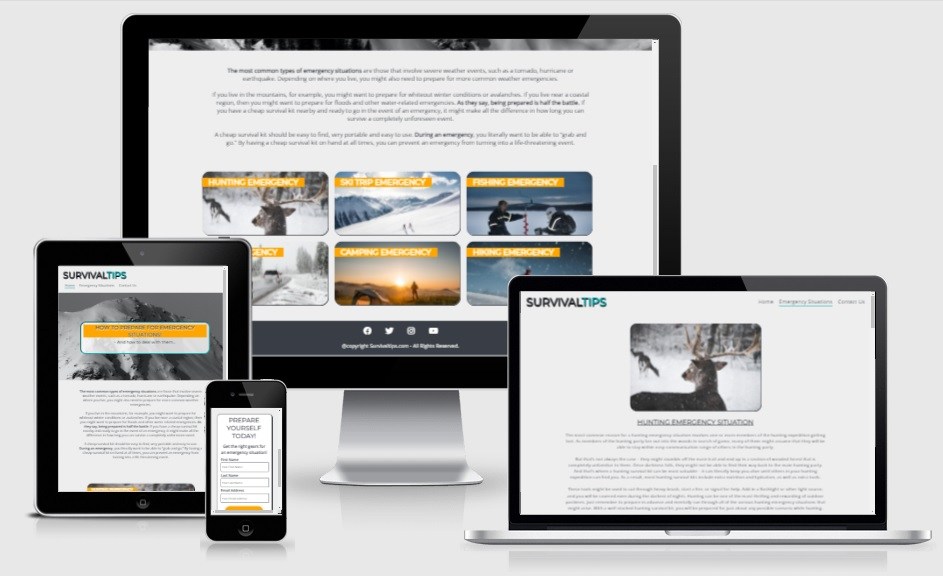
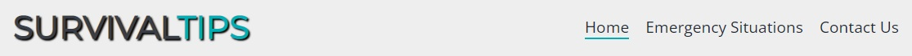
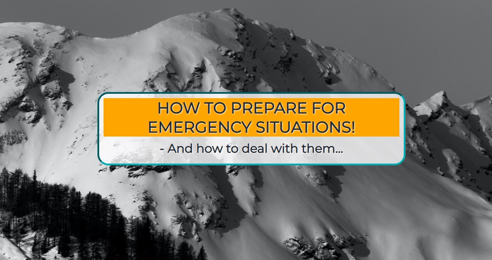
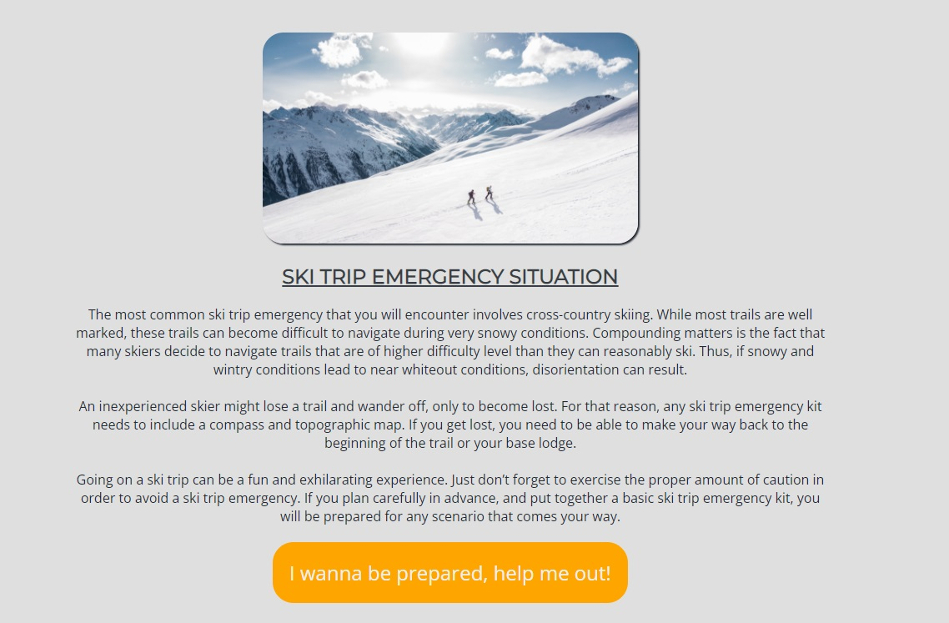
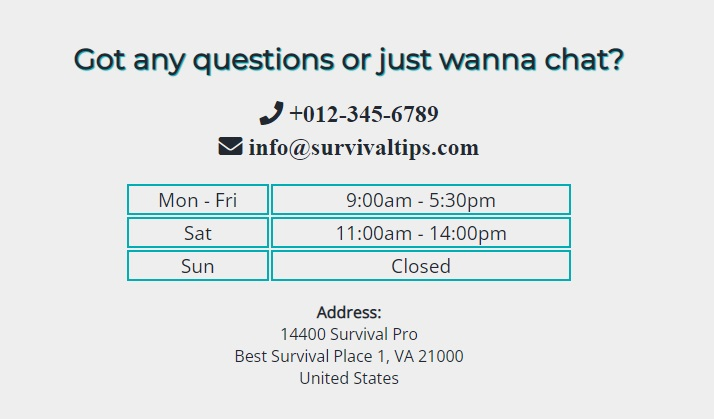
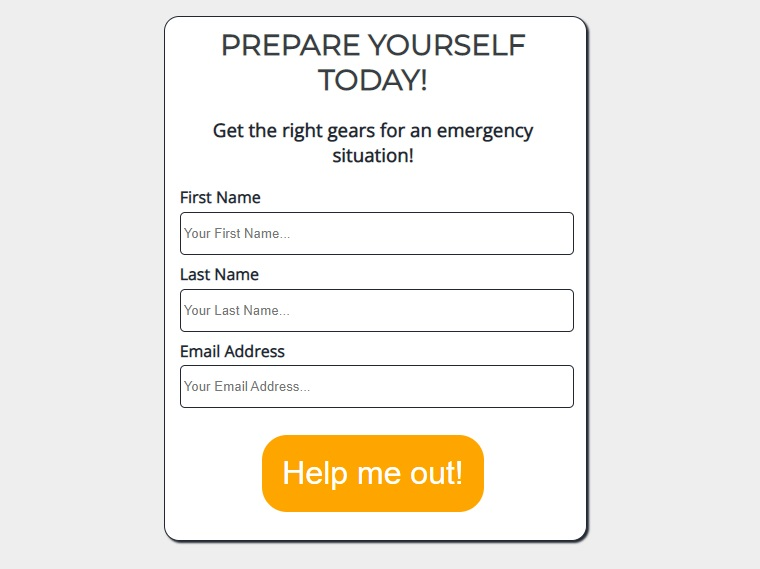

# **Survival Tips**
Survival Tips is a site for survival enthusiasts. And also for people that will get on a journey/trip anywhere in the world. 
This site will give the right information on how to PREPARE for an Emergency Situation (hunting emergency, ski trip emergency, fishing emergency, 
car emergency, camping emergency, hiking emergency), and also how to DEAL with them!

## Features

* **Header navigation bar**

    - The navigation bar includes links to Logo, Home Page, Emergency Situations and Contacy Us.
    - This full responsive navigation bar allow all users to easy navigate to all pages on this site, without the need of the "back" button.
    - This bar also have a hover effect that change color with mousehover, and an underline is shown on the link that currently is active.

* **Main image**

    - The main image is a of a big snowy mountain (associates to nature, survival, outdoor activities).
    - And this image also got an eye catching overlay text, that tell the user he/she is on the perfect site he/she was looking for.

* **Emergency Situations Section**

    - This section got a short description on the most common emergency situations. This will tell the user that it is VERY important to be prepared if you going on a trip for an outdoor activity.
    - Below this short description there are 6 images that shows the different emergency scenarios, with a matching text on the images.
    - All images on this section got a link, and this link will redirect the user to Emergency Situations page with full description on these emergency situations.

* **Footer section**

    - The footer section got 4 social media pictures with links that opens up in a new tab (facebook, twitter, instagram, youtube).
    - This section also have a copyright text (under the social media pictures).

* **Emergency Situations page**

    - This page contains full information about the 6 emergency situations listed on the Home page.
    - Each emergency situation got a bigger image shown, and the text is shown below the image.
    - And after each text section there is a button with the text "I wanna be prepared, help me out!". When a user clicks this button, they will land on a form page.

* **Contact page**

    - This page got a "business location image" at the top, and a text under the image with the question: "Got any questions or just wanna chat?".
    - User can also find a telephone number, email address and a business street address. Opening times is shown and made by a "table" code.

* **Form page**

    - This page is "hidden". The user need to click the way through Home page --> Emergency Situations --> and then click on a button of their choice.
    - Form page got a image at the top of the page, and a form below the image. This form the user need to input their first name, last name, and their email address. the submit button will send the form. The user will receive great options of survival gears, sent to their email address.

## UX

* **User story**

    - A survival enthusiast will find useful information on this site about emergency situations, that can happen to anyone and anywhere. This information is perfect so he/she will be prepared for their planned trip/journey. And also get useful information how to deal with them if they occure.

* **Site goal**

    - The goal of the site is to capture "strong leads" in the survival nich. With strong leads I mean that they need to commit through the page with 2 link-clicks, before they can fill in the "form", to get tips and ideas of emergency survival gear to buy before their planned trip.

## Testing

* **Validator testing**

    - HTML - No errors when checked with "W3C validator".
    - CSS - No errors when checked with "Jigsaw validator".
    - This site is responsive. Different browsers work with this site (firefox, chrome, safari, edge). All link and buttons work, "form" also works.
    - Lighthouse site tested, with good score.

## Bugs

    - No bugs detected.

## Unfixed bugs

    - No unfixed bugs.

## Technologies

* **Languages used**

    - HTML
    - CSS

## Programs

    - Gitpod, used for code writing.
    - Githud, store data.
    - Git, version control.

## Deployment

* **Was deployed to Github pages. The steps are:**

    - Github repository --> settings tab --> source section drop-down menu --> main
    - When selected "main", page will be automatically refreshed with a detailed ribbon display to indicate the successful deployment.
    - The site link: https://jimmythepro.github.io/survival-tips//index.html

## Credits

* **Content**

    - Information text on this site is bought from https://www.fiverr.com/
    - Fonts imported from https://fonts.google.com/
    - Flexbox code layout learned from https://css-tricks.com/snippets/css/a-guide-to-flexbox/
    - Used anchor links, learned from https://www.w3docs.com/snippets/html/how-to-create-an-anchor-link-to-jump-to-a-specific-part-of-a-page.html
    - Color palette picked from https://colorhunt.co/

* **Media**

    - All the images taken from https://www.pexels.com/
    - The icons is taken from https://fontawesome.com/

